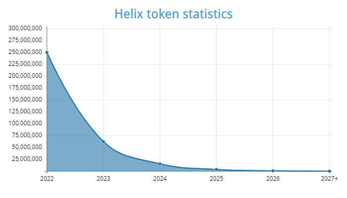
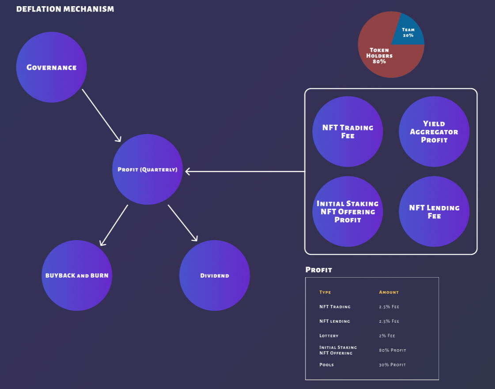
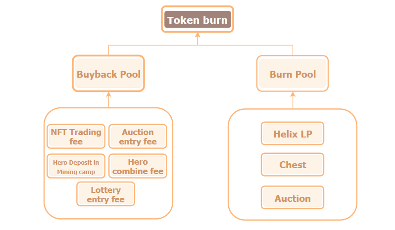
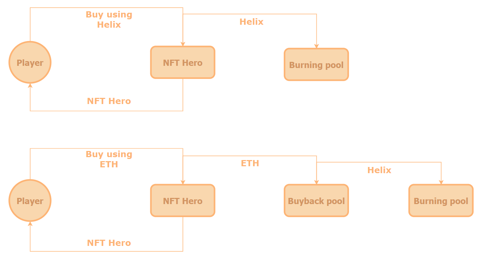

# Welcome

## Танилцуулга

Helix нь олон нийтэд чигэлсэн **GameFi** платформ бөгөөд хэрэглэгчдийг оролцоо, сэтгэл ханамж, идэвхи-ээс хамаарч тэднийг урамшуулах зарчимтай шинэлэг төсөл юм. Хурдацтай өсөж байгаа одоогийн нийгэмд Крипто зах зээлийн шинэ үеийн дижитал валютыг ашиглан тоглоом тоглонгоо өөрийн эдийн засагаа хянах боломжыг Helix бий болгоод байна.


Helix нь шинэ эрин үеийг бий болгосон төвлөрсөн бус / олон нийтэд чигэлсэн / хөгжүүлэгчдэд ээлтэй **GameFi**  платфором юм.

### PLAY DIFFERENT !


## Related Links

| Website | Links |
| :--- | :--- |
| **Official website** | Helix.zone |
| **DApp**  |  |
| **Twitter** |  |
| **Medium** |  |
| **Telegram** |  |
| **Discord** |  |
| **Helix Pool** |  |
| **Helix Token** |  |

## Contract Address

| Contract | Address |
| :--- | :--- |
|  |  |

Team Helix is all about transparency in everything we do.  Above is a list of our Smart Contracts that can be found in our github and BSCscan.

## About System

Helix токэны хувьд Mintable, Covernance, Crosschain хосолсон ERC20 сүлжээны токэн юм.  Эхны жил 250,000,000 сая токэн минт хийгдэх ба дараагийн жилээс 4 дахин бага mint хийгдэх болно.

Бил тооцоо судалгаан дээр үндэслэн токэний тоо ширхэгийг тооцоолж Шаталт өндөр болгохоор хийсэн. Энэ нь Hold хийхэд хамгийн хамгийн тохиромжтойг илтгэж өгнө.

### Halving Mint Amount

| Year | Amount |
| :--- | :--- |
| 1 | 250,000,000 HEL |
| 2 | 62,500,000 HEL |
| 3 | 15,625,000 HEL |
| 4 | 3,906,250 HEL |
| 5 | 976,562 HEL |
| 6+ | 244,140 HEL |



## Deflation Mechanism

Хэрэглэгч **Helix \(HEL\)** - ыг ашиглан худалдан авалт хийх болгонд бид тэрхүү орж ирсэн токэнийг шатаах үйлдэл хийгдэх бөгөөд илүү их худалдан авалт илүү их шатаалтыг бии болгоно.

%%% of all profits across the platform is directed into an "auto buyback and burn" pool consisting of **BNB, ETH, Matic**. The smart contracts will constantly check the average **Helix** price in the past 72 hours. Whenever the price falls below the 72 hour average price the smart contract will be triggered to swap the funds in the pool for **Helix \(HEL\)** tokens at a random time.

### Scenarios

