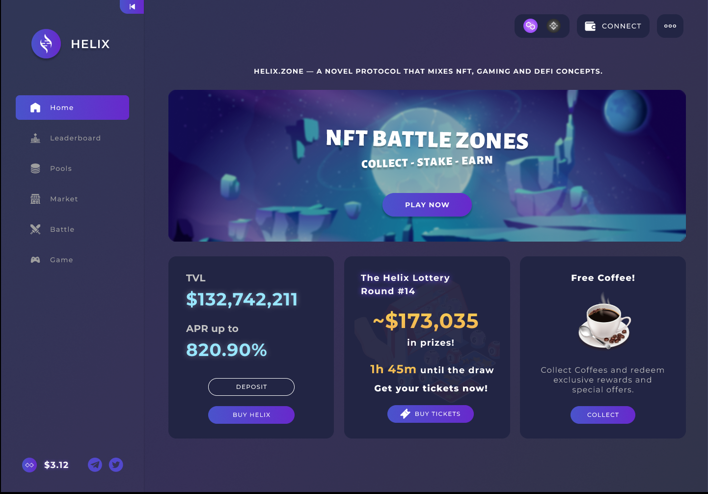

# Gamefi

**Play to Earn** 

Gaming should be fun.  Rather than having to think about every single penny you spend and taking up all your time, wouldn’t it be great to play to earn?  

MOBOX has built a unique infrastructure that builds on the growing **DeFi ecosystem and combines it with Gaming** through unique NFTs.  Using Liquidity Pools, Yield Farming, and NFTs, the GameFi infrastructure will not just find the **best yield strategies for users but also generate unique NFTs** that can be used across a multitude of games.  This gives MOBOX users the unique ability to **play for free and to earn** in one singular process.  

Imagine a series of games where you don’t actually spend your hard earned money to purchase in-game resources or heroes, but rather a saving’s account where the more you save the more resources you earn and the more heroes you can summon.

By providing liquidity to certain CRATES \(pools\),  CRATE contracts will automatically deliver the best yield for users by utilizing optimal yield farming strategies. 

