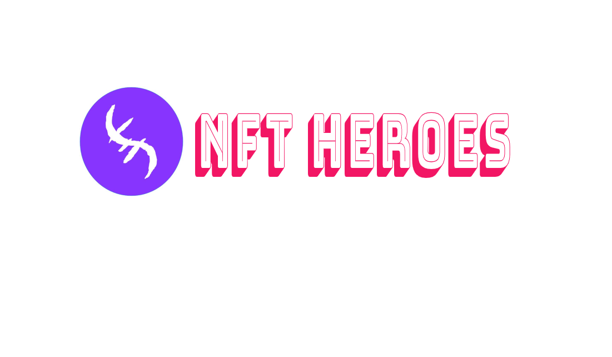

# Summary

## Old Games

Онлайн тоглоомын салбар маш өрсөлдөөнтэй салбар бөгөөд монополь компаниуд таны мэдээлэл, цаг, мөнгөний төлөө өрсөлддөг. Ихэнх компаниуд хэрэглэгчдээ алдахгүйн тулд янз бүрийн тоглоом шинээр хөгжүүлдэг. Тэдний арга техник маш нарийн янз бүр бөгөөд ихэнхдээ таны дур сонирхолд нийцүүлэн зөвхөн тоглоом гэлтгүй зарим төрлийн Апп маш олноор нь хөгжүүлдэг. Жишээ нь:                                                                                                                                                  - X тоглоом нь газар нээдэг тоглоом. Та тухайн тоглоомонд бүртгүүлсэнээр 1 газрийг үнэгүй өгч та тэрхүү газрийг өөрийн сонирхолын дагуу хөгжүүлэн түвшин ахиж шагналуудыг авдаг. Гэтэл та 2 дахь газрийг төлөхийн тулд оноо шаардлагатай бөгөөд таны оноо хүрэхгүй худалдан авахаас өөр араггүй болно. Түүнийгээ дагаад янз бүрийн шагнал урамшуулал өгдөг.

 Гэсэн хэдий ч хэрэглэгчийн зарцуулсан бүх цаг хугацаа, мөнгийг авч үзвэл шагнал нь тэнцвэртэй байдлыг бий болгоход хангалтгүй юм. 2020 оны байдлаар тоглогчид тоглоомонд 87 тэрбум доллар зарцуулсанаас эргүүлж тоглогчид уруу оруулсан хөрөнгө оруулалт 0 доллар. 

## New Generation NFT Heroes

Бид хэрэглэгчдийнхээ эрх ашигийг нэн тэргүүнд тавьж дуртай тоглоомоо тоглонгоо хэрхэн ашиг олж болох талаас нь хийхийг зорьсон. Helix нь Defi болон NFT -ыг нэгтгэсэн Gamefi төсөл бөгөөд бид хэрэглэгчдийнхээ идэвхи зүтгэл, зориулж байгаа цаг хугацааг харгалзан үзэж урамшуулах тэднийг идэвхижүүлэх системтэйгээр тоглоомоо бүтээсэн юм. 


#### PLAY DIFFERENT!!


Бидний алсын хараа нь NFT болгон дангаараа байх ёсгүй, харин NFT бүрийг өөрийн платпормтой  холбож, NFT тус бүрийг өвөрмөц үйлдэлтэй, илүү үнэ цэнэтэй болгон тоглогч бүр өөрийн цуглуулгаа ашиглан манай платформ дээр ашиг олонгоо хөгжилдөх боломжийг бүрдүүлэх юм.

